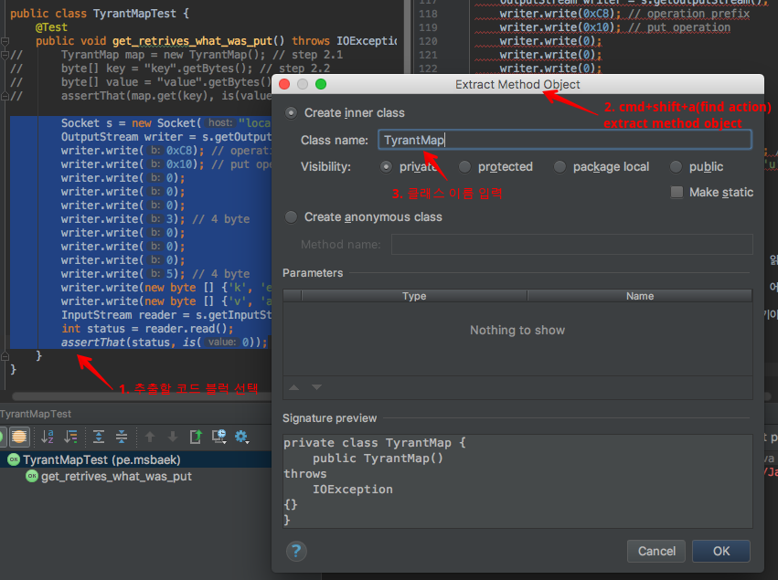
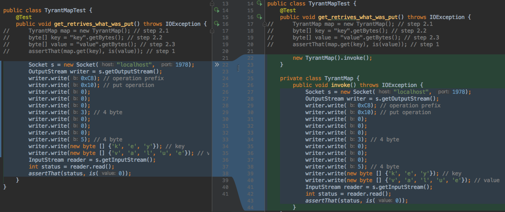
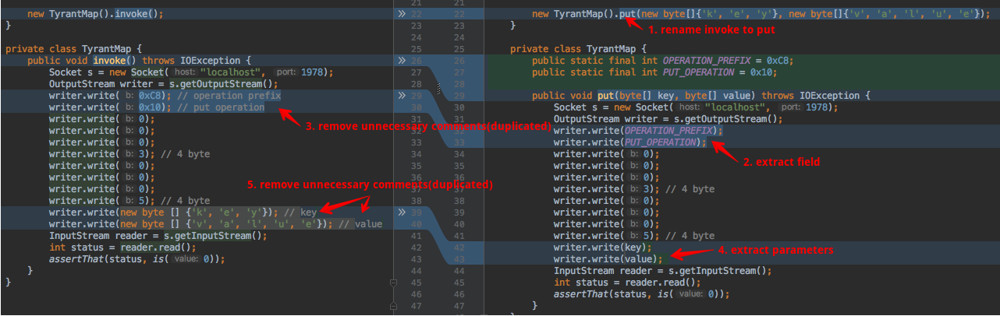
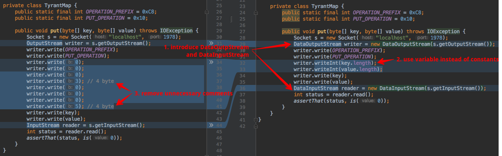
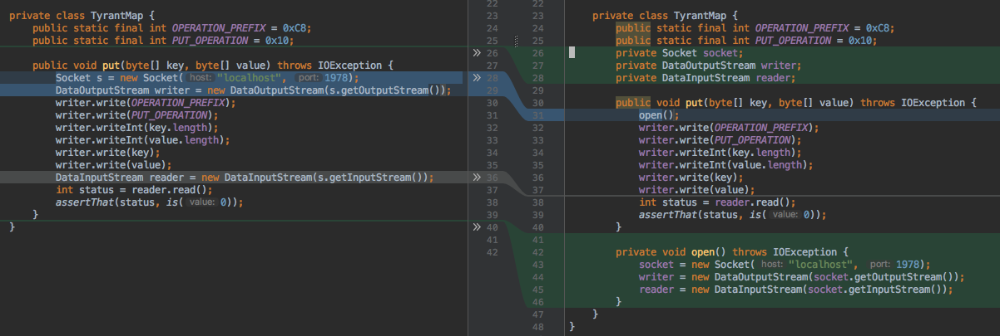
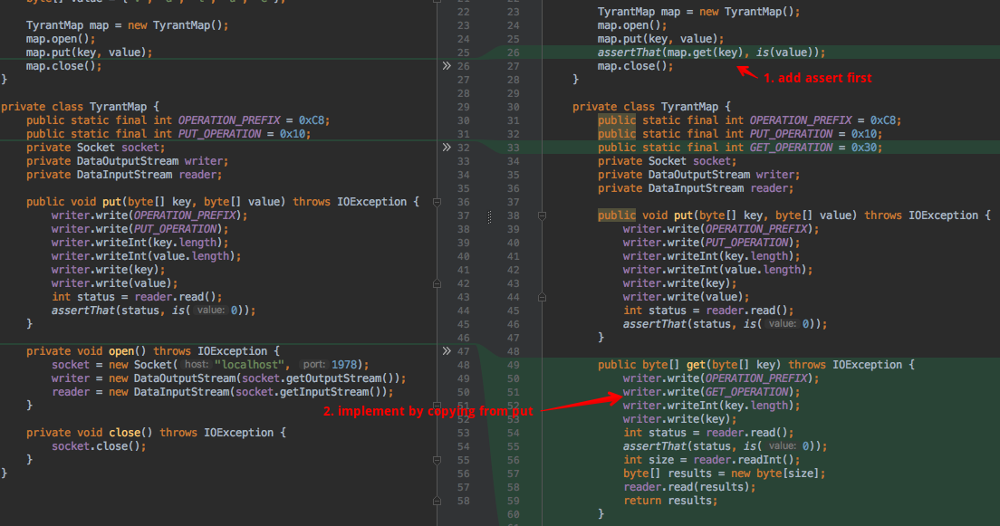

## Overview

이 프로젝트는 tokyo-tyrant의 java client를 만드는 시작 부분을 TDD로 진행하는 과정을 보여줍니다

Kent Beck의 [원본 video](http://pragprog.com/screencasts/v-kbtdd/test-driven-development)를 저자의 양해를 구해서 약간의 각색, 부연 설명을 추가했습니다

이 예제는 mac, [home brew](https://github.com/Homebrew/brew), IntelliJ 를 사용하는 것을 가정하고 진행됩니다.

## 1. Create TODO List

Kent Beck은 TDD의 첫번째 단계는 해야 할 목록 즉 TODO 목록을 작성하는 것이라고 합니다.

아래와 같이 TODO를 작성.

```language
TODO
Function List
--------------------------------
* put(0x10)
* get(0x30)
* remove(0x20)
* vanish(0x72)
* iterator
* size(0x80)
* reset(0x50)
* get next key(0x51)
* not found(1)
* success(0)

port    1978
--------------------------------

packet structure
--------------------------------
1   OPERATION_PREFIX(0xC8)
1   OPERATION_CODE
4   key length
4   value length
n   key
n   value
```

TODO에는 구현할 기능 목록, tyrant 접속 포트번호, TCP Packet 구조 등을 기록.

## 2. Start with High Level Test

원하는 것이 무엇인지를 표현하는 상위 레벨의 테스트로 시작한다.

이때 assert 부터 반대 순으로 테스트를 작성한다.

그리고 intellij의 show intention actions(opt+enter)를 이용해서 진행한다.

```java
public class TyrantMapTest {
	@Test
	public void get_retrives_what_was_put() {
		TyrantMap map = new TyrantMap(); // step 2.1
		byte[] key = "key".getBytes(); // step 2.2
		byte[] value = "value".getBytes(); // step 2.3
		assertThat(map.get(key), is(value)); // step 1
	}

	private class TyrantMap { // step 2.4
		public byte[] get(byte[] key) { // step 2.5
			return new byte[0];
		}
	}
}
```

## 3. Commnet Out

이 테스트가 우리가 궁극적으로 원하는 바이지만,

이걸 구현하려면 수십분이 걸리고, 테스트가 실패한다면 어디에 오류가 있는지 계속 따라 들어가면서 찾아야 한다.

그럴려면 수시간이 걸릴 수 있다. ㅠㅠ

제일 먼저 실행해 볼 수 있는 쉬운 일로 시작해야 한다.

원하는 바를 잘 기억하기 위해 지우지 않고 comment out만 하고,

문제를 작게 나눠서 짧은 싸이클로 개발하고 피드백을 얻을 수 있도록 한다.

## 4. 제일 쉽고, 바로 실행해 볼 수 있는 일로 시작

무엇을 제일 먼저 해 봐야 할까 ?

socket 접속이 되는지 부터 확인한다.

`new Socket("localhost", 1978);`

그리고 실행해 본다.

tyrant 서버가 기동되어 있지 않아 `java.net.ConnectException: Connection refused`이 발생한다.

### 4.1 tokyo-tyrant 설치 및 기동

`brew install homebrew/boneyard/tokyo-tyrant`

https://github.com/Homebrew/homebrew-boneyard 를 참고해서 home brew repo에서 제거된 패키지 설치 

아래와 같이 서버 기동

`/usr/local/Cellar/tokyo-tyrant/1.1.41_1/bin $ ./ttserver`

이제 테스트는 성공한다.

## 5. put해 본다.

소켓 접속이 되면 put을 해 보고 제대로 put되었는지 확인해 보고 싶을 것이다.

코드를 작성하고 실행해 본다

```java
	Socket s = new Socket("localhost", 1978);
	OutputStream writer = s.getOutputStream();
	writer.write(0xC8); // operation prefix
	writer.write(0x10); // put operation
	writer.write(0);
	writer.write(0);
	writer.write(0);
	writer.write(3); // 4 byte
	writer.write(0);
	writer.write(0);
	writer.write(0);
	writer.write(5); // 4 byte
	writer.write(new byte [] {'k', 'e', 'y'}); // key
	writer.write(new byte [] {'v', 'a', 'l', 'u', 'e'}); // value
	InputStream reader = s.getInputStream();
	int status = reader.read();
	assertThat(status, is(0));
```
## 6. Refactoring

모든 코드는 이야기 하듯이 작성되어야 한다(잘 쓰여진 산문처럼 읽을 수 있어야 한다).

그런데 이 코드는 테스트가 무엇을 하는지 이야기하고 있지 않고 어떻게 구현되었는지를 드러내고 있다(구현 디테일을 드러내고 있다).

커멘트 처리한 처음 3줄이 테스트가 무엇을 하는지에 대한 이야기이다.

### 6.1 Extract Method Object - TyrantMap

Detail 코드를 객체로 추출한다





### 6.2 more refactoring

- rename invoke to put
- extract field(OPERATION_PREFIX, PUT_OPERATION)
- remove unnecessary comments(duplicated)
- extract parameter(key, value)



### 6.3 Introduce DataInputStream and DataOutputStream



### 6.4 extract method open(bottom up)
    
- move line up(reader)
- extract fields



### 6.5 implement method close(top down)

### 6.6 call open/close

- extract variable
- call open from test not in put
- extract variable(key, value)

## 7. implement get

- add assert
- implement by copying from put



